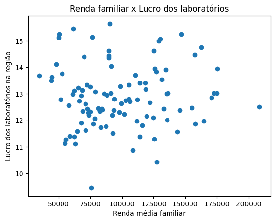
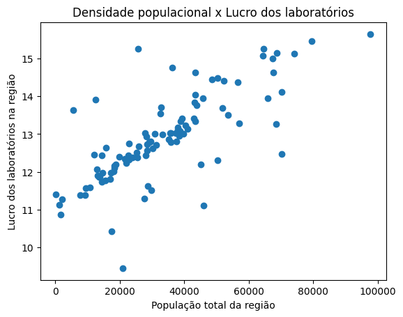
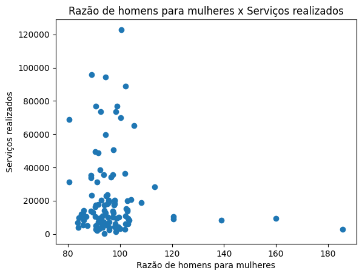
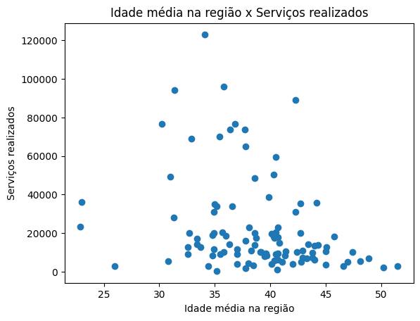
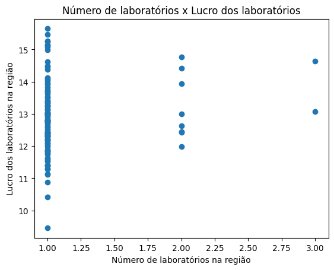

<!-- capa -->

# Análise de dados para expansão de uma rede de laboratórios

**Desenvolvido por:** Adonai Arruda
**Desenvolvido em:** Abril/2025

<ul><li>

</li></ul>

--- 

## Contextualização 

Uma rede de laboratórios pretende abrir novas filiais e necessita analisar regiões mais propícias para o empreendimento. 

A partir de dados transacionais das fmais de 100 filiais já em funcionamento, dados demográficos, geográficos e econômicos das regiões disponíveis para novas lojas, este estudo pretende realizar uma análise e indicar 3 potenciais regiões para implementação de uma ou mais filiais.  

--- 

## Bases de dados

### Fontes de Dados Utilizadas
* **Transacionais:** Registros de exames realizados por paciente e laboratório.
* **Exames:** Informações sobre os tipos de exame.
* **Geográficos:** Localização dos laboratórios (Lat/Long, ZCTA).
* **Econômicos:** Indicadores socioeconômicos agregados por ZCTA.
* **Demográficos:** Indicadores demográficos e populacionais agregados por ZCTA.

--- 

## Metodologia

1.  **Coleta:** Extração, limpeza e integração das 5 fontes de dados (Transacional, Exames, Geo, Econ, Demo).
2.  **Limpeza:** Tratamento de dados ausentes, duplicados e inconsistências.
3. **Hipóteses de negócio:** Definição de hipóteses a serem testadas.
4.  **Agregação:** Dados transacionais agregados por ZCTA, com contagem de exames e valores totais.
5.  **Análise Exploratória de Dados (EDA):** Geração de hipóteses sobre a natureza do problema e análise estatística para avaliar possíveis soluções e indicadores para avaliar as ZCTAs
6.  **Seleção da região:** Escolha fundamentada das 3 ZCTAs com maior destaque nos critérios definidos.

--- 

## Limpeza de dados

- Foi realizada limpeza e validação de dados individualmente em cada base de dados. As principais etapas foram:
* Na base de dados transacionais:
  *  Criação da variável `age_at_service` (idade do paciente na data do exame).
  *  Tratamento de outliers de idade (ex: > 160 anos) via _Winsorização_ na variável `age_at_service`.
  *  Padronização do formato decimal em 'Testing cost'

---

*  Na base de dados demográficos:
   *  Remoção de ZCTAs com menos de 10 habitantes nos dados demográficos
   *  Tratamento de outliers via _Winsorização_ em dados de proporção de gênero
   *  Imputação da mediana de idade em regiões sem estes dados

*  Na base de dados econômicos 
   *  Remoção de duplicatas
   *  Criação da variável de receita média `WeightedMeanIncome`
   *  Criação da variável de total de residências `TotalHouseholds`
  
* Na base de dados geográficos
  *  Transformação de código de área `Zipcode` para `ZCTA`

--- 

## Hipóteses de negócio

Foram elaboradas 5 hipóteses para serem analisadas:
1. Áreas com maior poder aquisitivo (renda familiar) têm maior potencial de lucro para os laboratórios.
2. Áreas com maior densidade populacional apresentam maior lucro para os laboratórios.
3. Áreas com população mais feminina apresentam maior demanda de serviços de laboratório.
4. Áreas com população mais idosa apresentam maior demanda de serviços de laboratório.
5. Áreas com mais de um laboratório apresentam menor lucro.

---

## Agregações

Os dados transacionais consistem na base de dados fundamental para obter as informções relevantes para responder às hipóteses elaboradas anteriormente. 

Combinando dados de exames e geográficos é possível obter:
- Lucro por exame
- Região que o laboratório se encontra

---

Combinando dados econômicos e demográficos, é possível obter informações sobre as regiões onde já existem laboratórios, como:
- Total de residências 
- Receita média por residência 
- População total
- Razão entre homens e mulheres da população 
- Mediana de idade da população 

Essas informações extraídas das bases são suficientes para responder as hipóteses de negócio criadas anteriormente.

---

 

  ### Hipótese 1: 

  _Maior potencial aquisitivo = maior lucro_

  **Falso**

  

  A relação mostrada na figura ao lado mostra que, uma região mais rica (renda familiar média maior) não necessariamente se traduz em um maior lucro dos laboratório na região.
  

 

---

 

  ### Hipótese 2: 

  _Maior densidade populacional = maior lucro_

  **Verdadeiro**

  

  A relação mostrada na figura ao lado mostra que, laboratórios em regiões mais povoadas tendem a obter maior lucro.
  

 

---

 

  ### Hipótese 3: 

  _População mais feminina = maior demanda_

  **Falso**

  

    Não é possível perceber um padrão claro entre a razão de homens para mulheres e o total de serviços realizados, mesmo desconsidrando valores extremos.
  

 

---

 

  ### Hipótese 4: 

  _População mais idosa = maior demanda_

  **Falso**

  

    Não é possível perceber o efeito da idade média da região em relação a quantidade de serviços realizados.
  

 

 ---

 

  ### Hipótese 5: 

  _Mais laboratórios = menor lucro_

  **Inconclusivo**

  

    Não é possível perceber um padrão entre o número de laboratórios em uma região e o lucro da região. Porém, a quantidade de regiões com mais de um laboratório é pequena para tirar uma conclusão afirmativa sobre esta hipótese. É sugerido estudos futuros para se aprofundar nesta hipótese.
  

 

 ---

## Conclusão

Baseado nas análises feitas anteriormente, é recomendada a implementação de novas filiis da rede de laboratórios em regiões (ZCTAs) com maior densidade populacional e que ainda não possuem laboratórios da rede em funcionamento.

Conclui-se que a renda, gênero ou perfil etário de uma determinada região não influciam significativamente no lucro dos laboratórios de uma região, porém, a densidade populacional sim.

---

## Recomendação

**Desta forma os ZCTAs indicados são:**

- ZCTA5 77449
- ZCTA5 77494
- ZCTA5 11368

---

# **Obrigado!**

<ul><li>

</li></ul>

